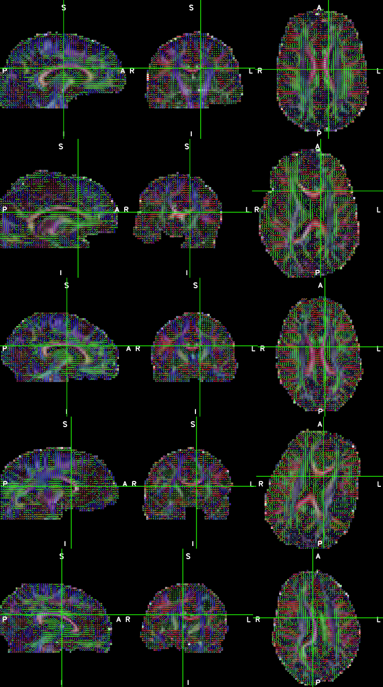

## About

dcm_qa_dti is a simple DICOM to NIfTI validator script and dataset. This repository is similar to [dcm_qa](https://github.com/neurolabusc/dcm_qa), but includes diffusion images from a Siemens MRI scanner.

## Running

Assuming that the executable dcm2niix is in your path, you should be able to simply run the script `batch.sh` from the terminal.

## Links

 - Conversion of Diffusion Tensor Imaging is described in the [dcm2niix manual](https://www.nitrc.org/plugins/mwiki/index.php/dcm2nii:MainPage#Diffusion_Tensor_Imaging).
 - A Word-format document describes how to validate diffusion directions [with your own sequences](https://www.nitrc.org/docman/?group_id=880).

